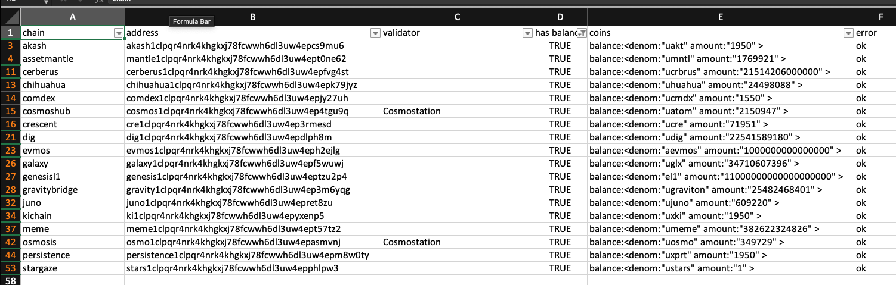

# findaccount

Tool for identifying what IBC chains an account exists on. Give it an address and it will query public RPC nodes and print out CSV with info.

**Important** it is necessary to retrieve the JSON files from the [Cosmos chain-registry](https://github.com/cosmos/chain-registry). To do this, run the [chains/fetch.sh](chains/fetch.sh) script.

Build: 

```
bash ./chains/fetch.sh
go get ./...
go build -o findaccounts cmd/findaccounts/main.go
```



Example:

```
$ findaccounts juno1aeh8gqu9wr4u8ev6edlgfq03rcy6v5twfn0ja8 | grep true
chain,address,has balance,coins,error
agoric,agoric1aeh8gqu9wr4u8ev6edlgfq03rcy6v5twduwk2d,false,,ok
akash,akash1aeh8gqu9wr4u8ev6edlgfq03rcy6v5twj6pwrp,false,,ok
axelar,axelar1aeh8gqu9wr4u8ev6edlgfq03rcy6v5twm06p36,false,,ok
bandchain,band1aeh8gqu9wr4u8ev6edlgfq03rcy6v5twxwvtzn,false,,ok
cerberus,cerberus1aeh8gqu9wr4u8ev6edlgfq03rcy6v5twrxvq0s,true,balance:<denom:"ucrbrus" amount:"514436665011420" > ,ok
chihuahua,chihuahua1aeh8gqu9wr4u8ev6edlgfq03rcy6v5twu5p8me,true,balance:<denom:"uhuahua" amount:"15375994400" > ,ok
cosmoshub,cosmos1aeh8gqu9wr4u8ev6edlgfq03rcy6v5twlpvf6m,true,balance:<denom:"uatom" amount:"37256755969" > ,ok
crescent,cre1aeh8gqu9wr4u8ev6edlgfq03rcy6v5twmflv0k,false,,ok
emoney,emoney1aeh8gqu9wr4u8ev6edlgfq03rcy6v5twszkadx,false,,ok
evmos,evmos1aeh8gqu9wr4u8ev6edlgfq03rcy6v5twaqa8qn,true,balance:<denom:"ibc/ED07A3391A112B175915CD8FAF43A2DA8E4790EDE12566649D0C2F97716B8518" amount:"5000" > ,ok
firmachain,firma1aeh8gqu9wr4u8ev6edlgfq03rcy6v5tw3jy7tp,false,,ok
gravitybridge,gravity1aeh8gqu9wr4u8ev6edlgfq03rcy6v5twm373ln,true,balance:<denom:"ugraviton" amount:"4287" > ,ok
impacthub,impact1aeh8gqu9wr4u8ev6edlgfq03rcy6v5twm9e5hp,false,,ok
juno,juno1aeh8gqu9wr4u8ev6edlgfq03rcy6v5twfn0ja8,true,balance:<denom:"ibc/008BFD000A10BCE5F0D4DD819AE1C1EC2942396062DABDD6AE64A655ABC7085B" amount:"686021124" > ,ok
kava,kava1aeh8gqu9wr4u8ev6edlgfq03rcy6v5twr5c5vu,false,,ok
konstellation,darc1aeh8gqu9wr4u8ev6edlgfq03rcy6v5twqqcchv,false,,ok
nomic,nomic1aeh8gqu9wr4u8ev6edlgfq03rcy6v5twrelnf3,false,,ok
octa,octa1aeh8gqu9wr4u8ev6edlgfq03rcy6v5twwamf20,false,,ok
odin,odin1aeh8gqu9wr4u8ev6edlgfq03rcy6v5twmp22k3,false,,ok
oraichain,orai1aeh8gqu9wr4u8ev6edlgfq03rcy6v5twvj62mg,false,,ok
osmosis,osmo1aeh8gqu9wr4u8ev6edlgfq03rcy6v5twh6levf,true,balance:<denom:"uosmo" amount:"119849309021" > ,ok
regen,regen1aeh8gqu9wr4u8ev6edlgfq03rcy6v5twqr84vl,false,,ok
rizon,rizon1aeh8gqu9wr4u8ev6edlgfq03rcy6v5twuusckr,false,,ok
secretnetwork,secret1aeh8gqu9wr4u8ev6edlgfq03rcy6v5twaycq88,false,,ok
shentu,certic1aeh8gqu9wr4u8ev6edlgfq03rcy6v5twj0v5g6,false,,ok
sifchain,sif1aeh8gqu9wr4u8ev6edlgfq03rcy6v5tw6url4s,false,,ok
stargaze,stars1aeh8gqu9wr4u8ev6edlgfq03rcy6v5twtam532,true,balance:<denom:"ustars" amount:"493715660" > ,ok
terra,terra1aeh8gqu9wr4u8ev6edlgfq03rcy6v5twe9kfcm,false,,ok
```